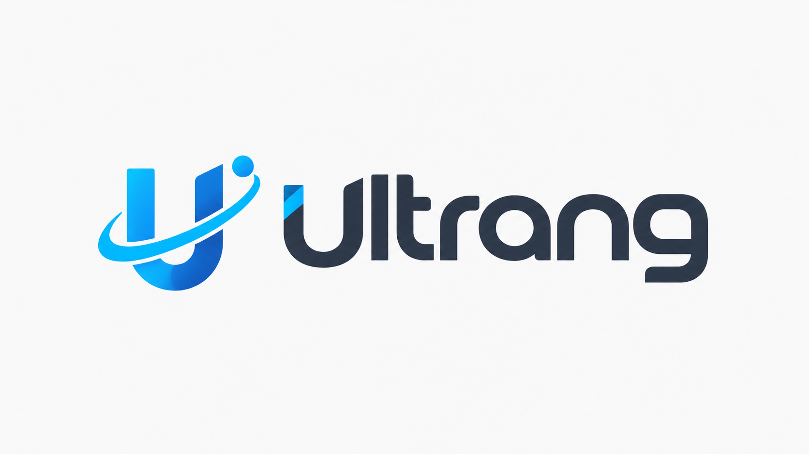
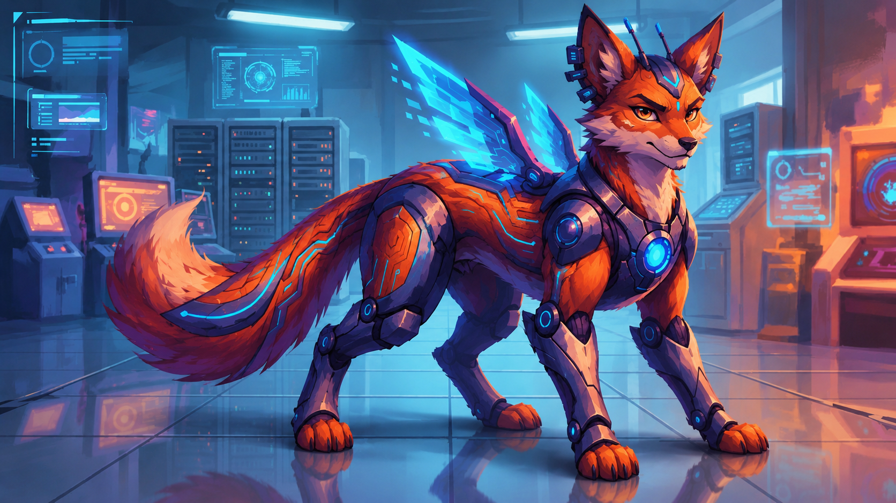
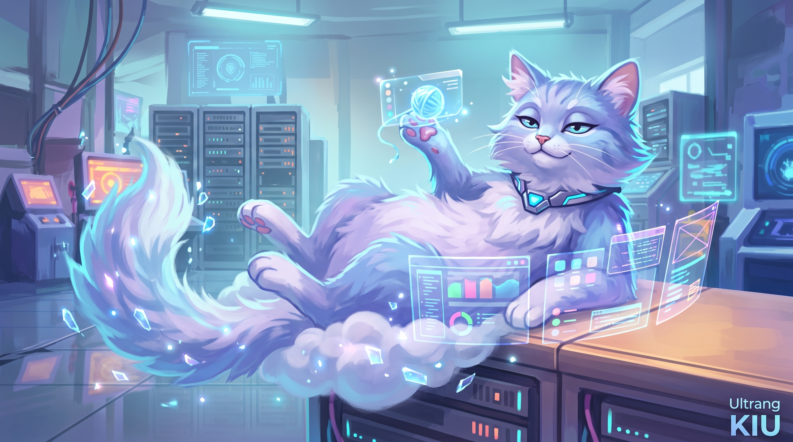

# 🚀 Bienvenido a Ultrang

**Construimos lo que imaginas.**

Ofrecemos soluciones tecnológicas modernas, enfocadas en la creación de aplicaciones web y móviles para pequeñas y medianas empresas que buscan digitalizar sus procesos, automatizar tareas o mejorar su presencia en línea.

[Misión](#-nuestra-misión-y-visión) • [Servicios](#-nuestros-servicios) • [Stack Tecnológico](#-nuestro-arsenal-tecnológico) • [Contacto](#-únete-a-la-conversación)

---

## 🎯 Nuestra Misión y Visión

**Misión:** Desarrollar soluciones tecnológicas a medida que resuelvan problemas reales y permitan a las empresas crecer mediante software moderno, eficiente y confiable.

**Visión:** Convertirnos en una empresa reconocida por la creación de sistemas de alto impacto, adoptando tecnologías web modernas y arquitecturas escalables para clientes de cualquier parte del mundo.

### ✨ Valores Corporativos

Innovación | Transparencia | Calidad | Seguridad | Responsabilidad

---

## 🛠 Nuestros Servicios

Nos especializamos en construir software moderno, seguro, escalable y adaptado a las necesidades reales de cada cliente:

- 🌐 **Desarrollo Web Fullstack:** Soluciones integrales desde la concepción hasta el despliegue.
- ⚙️ **Backend / APIs:** Arquitecturas robustas (como Clean Architecture o MVC) para lógicas de negocio complejas.
- 🎨 **Frontend / Interfaces Modernas:** Experiencias de usuario fluidas y responsivas.
- 📱 **Aplicaciones Móviles (PWA & Multiplataforma):** Soluciones móviles que rinden al máximo en cualquier dispositivo, incluyendo estrategias offline-first.

---

## 💻 Nuestro Arsenal Tecnológico

Seleccionamos las mejores herramientas para garantizar un rendimiento óptimo, seguridad y escalabilidad en todos nuestros proyectos.

### Backend & Arquitectura

### Frontend & Web

### Móvil

### DevOps & Herramientas

### Bases de Datos

---

## 🚀 Proyectos Destacados

- 📊 **[PocketCap](https://github.com/Ultrang/movile-control-expenses):** Aplicación móvil de gestión de gastos.
- 🏃 **RunnerQuest:** Aplicación gamificada de actividad física con evolución de mascotas.

---

## 🤖 Nuestras Mascotas

En **Ultrang** creemos que el desarrollo de software no tiene por qué ser aburrido. Por eso, en cada línea de código nos acompañan nuestras mascotas, que representan el espíritu y la cultura de nuestro equipo:

- 🐉 **Max (El Tecno-Alebrije)**

  Él es analítico, estructurado y un poco obsesivo con el código limpio. Es la mente arquitectónica; le encanta diseñar bases de datos robustas y asegurar que la lógica del sistema sea indestructible. Su pasatiempo favorito es cazar _bugs_ complejos en la madrugada y refactorizar código heredado.

- ☁️🐈 **Kiu (El Gato-Nube Computacional)**
  
  **Personalidad:** Ágil, sigiloso y siempre relajado. Flota sin esfuerzo entre servidores. Representa la velocidad de nuestros despliegues y la fluidez visual de nuestras aplicaciones móviles y web.
  
  **Pasatiempo:** Tomar siestas sobre teclados cálidos mientras supervisa que los contenedores de Docker se ejecuten sin errores.

---

## 📬 Únete a la Conversación

¿Tienes un proyecto en mente? ¡Hagámoslo realidad!

  
  
  
  

